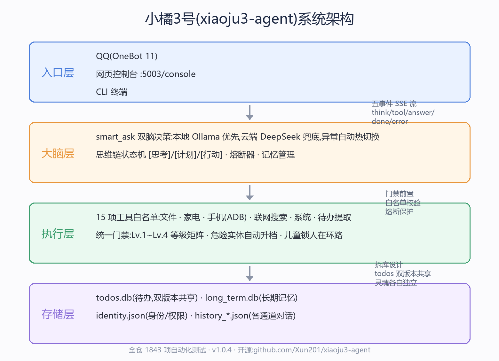
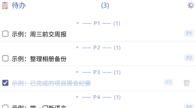

# 小橘3号（xiaoju3-agent）· AI+开源技术报告

> 参赛方向：开源赋能的 AI 应用创新 · 队伍名：小橘3号
> 团队构成：个人独立完成（大三学生）+ ZCode/DeepSeek 等 AI 辅助开发
> 仓库：https://github.com/Xun201/xiaoju3-agent（Apache License 2.0，署名 XUN）
> 测试基线：全仓 1874 passed + 4 skipped（2026-10-06 实测）

## 1 作品概述

**小橘3号**是运行在家庭家用设备上的私人 AI 管家系统：以"本地大模型优先、云端兜底"的双脑决策为核心，同一套权限与工具体系管控手机、家电、文件三类执行臂；通过 QQ 与网页控制台双入口服务全家，以真流式思维链提供大模型时代的关键用户体验。

**为什么做**：主流家庭 AI 产品（智能音箱、语音助手家族）在真实家庭里面临三道结构性门槛——①**使用门槛**：老人儿童不会装 App、注册账号；②**断网即聋**：大脑在云端，路由器重启的五分钟里设备完全失效；③**隐私上云**：家庭对话与作息数据的主权不在家庭手中。三道坎的共同答案是"把大脑搬回家、把入口做成家人已有的样子"——而实现它所需的几乎全部积木（大模型推理框架、Web 框架、浏览器自动化、家居中枢、消息协议）都来自开源世界。

**参赛方向契合**：本项目是"开源赋能 AI 应用创新"的完整样本——个人开发者（大三学生）站在开源生态的肩膀上，用 AI 辅助开发的方式，把 Ollama、Flask、Playwright、Home Assistant、OneBot 生态等十余项开源资源融合成一个此前只有大厂团队才能交付的家庭 AI 系统，并以 Apache 2.0 把成果回馈开源社区。

**核心亮点**：①本地优先双脑（断网对话可用、数据不出门）；②完整设备接管链（控手机/控家电/管文件，15 项工具统一白名单）；③物理安全底线+软件四级权限+儿童锁人在环路；④QQ 零门槛入口+桌宠人格化；⑤全仓 1874 项自动化测试的工程可信度。

## 2 需求分析与总体方案

针对三道坎确立四项设计目标，并逐一给出可验证的工程答案：

| 坎 | 设计目标 | 可验证答案 |
|---|---|---|
| 使用门槛 | 零门槛入口 | QQ 加好友即用，家庭 AI 门槛压缩为"发一条消息" |
| 断网即聋 | 本地优先 | 本地 Ollama 常驻，断网对话可现场演示；云端 DeepSeek 兜底 |
| 隐私上云 | 数据不出家门 | 对话/记忆/身份全部落本地盘；云端仅作推理兜底 |
| （工程底线） | 说得算数且安全 | 15 项工具统一门禁+四级权限+物理开关绝对优先 |

系统采用四层架构（图 2-1）：

| 层 | 职责 | 代表模块 |
|---|---|---|
| 入口层 | QQ（OneBot 11 协议）、网页控制台、CLI 三通道 | `main.py`、`xiaoju3_dashboard.py` |
| 大脑层 | 双脑决策、思维链、工具编排、记忆管理 | `brain.py`（smart_ask / smart_ask_stream） |
| 执行层 | 15 项工具白名单：文件/家电/手机/搜索/系统/待办 | `tools.py`、`home_tools.py`、`adb_tools.py`、`plugins/` |
| 存储层 | 长期记忆、待办、身份、对话历史（SQLite+JSON，拆库设计） | `agent_state/` |

四层的每一层都以开源组件为地基：入口层的 QQ 协议来自开源 OneBot 11 生态（NapCat 实现），大脑层的推理来自开源 Ollama 与 DeepSeek API，执行层的家居控制经开源 Home Assistant，存储层用 SQLite 公共域引擎——**没有一行闭源 SDK 是不可替代的**。

## 3 AI 技术作用、开源资源与边界

**AI 技术在本作品中的三重作用**：

1. **作为运行时核心**：本地 Ollama 跑 Qwen 系开源模型（qwen2.5:7b，Apache 2.0）承担日常对话与断网兜底；云端 DeepSeek（deepseek-chat）承担工具遵循要求高的任务（家电控制、待办提炼、开发日志生成）——真机实测本地小模型对工具 JSON 协议遵循不可靠，故家电类请求强制云端路由，这是数据驱动的可靠性取舍。
2. **作为开发生产力**：全部代码由 ZCode（AI 编程助手）与 DeepSeek 辅助编写，人类负责架构设计、方案拍板、代码审查、真机验证与权利核查——"个人+AI"完成了传统上需要小团队的项目体量（约 4.2 万行源码、1874 项测试、五份设计文档体系）。
3. **作为内容处理管线**：DeepSeek 分享链接 → Playwright 无头抓取 → 分片提炼待办/开发故事，是"AI 读 AI 的输出"的自动化流水线。

**自主开发与第三方边界（清晰可查）**：仓库内全部业务代码（入口/大脑/工具/权限/前端控制台/安装器）为本人自主编写；第三方能力全部通过公开接口或开源组件接入——Ollama（REST）、DeepSeek（官方 API）、Home Assistant（REST API）、NapCat（OneBot 11 HTTP）。xiaomi_home 集成（小米官方开源，Apache 2.0）以 custom_components 方式部署于 HA 侧，本仓库不含其代码。

**融合方式**：统一登记表（tool_registry）是开源组件融合的枢纽——工具白名单、权限分组、高危集合均为登记表视图，新增一个开源能力（如未来的涂鸦插座）只需登记一处、主体零改动；这正是开源"组合式创新"的架构化表达。

## 4 设计与实现

**核心功能实现要点**（详见技术方案，此处列开源协同最紧密的五件）：

- **双脑决策**（brain.py smart_ask）：硬件自适应路由三档（低配直连云/中配本地优先/云端兜底），单次请求内热切换用户无感；
- **真流式思维链**（v1.0.4 主打）：Ollama NDJSON 与 DeepSeek SSE 双消费器 → Flask SSE 五事件协议 → 前端渐进渲染；半途断流自动清理回退，口径零损失；本地热模型首事件 0.09~0.73 秒；
- **待办提取链**：QQ 甩链接 → 受理即回 → Playwright 无头抓取（零可见窗口）→ 4000 字符分片提炼（提示注入主防线内嵌 prompt）→ 六档优先级自动判级入库 → 面板分区/折叠/说明/硬删管理闭环；
- **四级权限+儿童锁**：Lv.1~Lv.4 递进门禁统一拦截 15 项工具；危险操作（燃气阀等）挂起并向在线成人 QQ 私聊推送裁决请求（/approve 或 /deny，5 分钟超时自动拒绝）；物理机械开关绝对优先于一切软件等级；
- **灵魂备份**：一个 zip 打包"身份/记忆/历史"，新设备解包即活；多设备 PeerWatch 互相守望。

**团队分工**：个人独立完成设计、开发、测试、文档与部署全流程；ZCode/DeepSeek 承担代码生成、方案推演与文档起草的辅助工作。

**生成式 AI 辅助开发的审核验证流程**（本项目的方法论贡献）：

1. **设计先行**：每个功能先出设计稿（动机/方案对比/拍板点），人工拍板后才动代码；
2. **锚测试纪律**：AI 生成的每个行为变更必须配"锚"——把关键契约（流式与同步输出逐字节一致、控制台指令清单 ⊆ 主清单、前端折叠逻辑必须在 click 监听器内）固化成测试，AI 代码过锚才算数；
3. **真机验收**：离线测试全绿 ≠ 完成，功能须在真实部署环境（正式版实例+真实 QQ/HA 链路）复验；
4. **权利核查**：AI 产出涉及第三方代码/文档时核查来源与许可（本报告附录清单即该纪律的产物）；
5. **基线纪律**：测试只增不减（1837→1874），多轮重构零回归。

## 5 成果展示与效果验证

**开源成果**（全部公开可查）：

| 成果 | 位置 |
|---|---|
| 源代码约 4.2 万行 + 29 个测试文件 | GitHub main 分支 |
| 设计文档体系（架构/功能/UI/五份专项设计稿+开发日志） | 仓库 docs/ 与根目录 |
| 安装器与发布 | Inno Setup 安装器，v1.0.4 Release（资产 sha256 核验） |
| 截图证据（流式/待办面板/指令菜单/架构图） | docs/img/ |

**效果验证**：

| 指标 | 数值 | 条件 |
|---|---|---|
| 自动化测试 | **1874 passed + 4 skipped** | 全仓 pytest |
| 本地首事件延迟 | 0.09~0.73s | Ollama 热模型，3 轮实测 |
| 云端受理延迟 | 0.36~0.92s | DeepSeek |
| 流式中并发轮询 | 0.505s 恒定 | 多线程零阻塞 |
| 家电控制成功率 | 真机 100%（云端单跳直达） | 含小米真实灯泡（xiaomi_home 接入） |
| 主动服务 | 场景规则 0 token 触发 | 回家开灯真机三拍演练通过 |

## 6 创新性与开放价值

**与同类比较**：纯本地方案（Ollama 生态）能聊不能做；云端音箱有执行臂但大脑在云、断网即聋、能力被厂商白名单锁死；开源家居中枢（Home Assistant 系）控家电强但无统一大脑与分级权限。**小橘3号把"本地优先+完整执行臂+家庭入口+人格化"四合一装进同一具受统一权限约束的身体——单看每项都有人做，四合一目前没有第二家。**

**开放成果与价值**：①全部代码、设计文档、测试、构建脚本 Apache 2.0 开源，可复现可审计；②"锚测试纪律"与"AI 辅助开发审核验证流程"对个人开发者社区有直接借鉴价值；③插件登记表架构为社区接入新品牌/新能力提供了零改动主体的扩展范式；④家庭场景的"物理安全底线"设计（软件权限永不让家庭失去物理控制权）作为安全实践公开。

**维护计划**：比赛后继续以"纯技术人路线"维护——开源换声誉、社区 issue/PR 响应、按登记表范式扩展多品牌插件（涂鸦插座接入中）、探索 Windows Hello 真二因子与记忆权重自演化。

## 7 合规安全与风险

| 项 | 合规状态 |
|---|---|
| 开源许可证 | 全部依赖逐项核查（见附录清单）：Apache 2.0/MIT/BSD/PSF/公共域等宽松许可，无 GPL 传染性组件进入分发物；本仓库以 Apache 2.0 发布，符合各上游署名要求 |
| 数据隐私 | 家庭对话/记忆/身份全部本地存储（agent_state/，.gitignore 防入库）；云端仅推理兜底不落数据；位置记忆仅存本地文件；仓库历史经全量敏感扫描（零密钥/零内网真实 IP 入史） |
| AI 输出审核 | 模型输出经统一出口净化（CQ 码/图片链接剥离）；工具调用白名单+等级门禁+熔断器三重拦截；危险操作人在环路裁决 |
| 知识产权边界 | 本仓库原创业务代码自主产权；第三方组件按接口调用不修改分发（xiaomi_home 为 HA 侧独立部署）；部分创新点涉及专利申请流程中的内容按"先申请后公开"纪律受限提交，公开文档不包含申请前技术细节 |
| 已知风险 | 本地小模型工具遵循不可靠（已用强制云端路由缓解并如实披露）；DeepSeek 分享链接有时效（通知文案优化排队中）；NapCat 为非官方协议实现，存在被平台限制的理论风险（自托管可控） |

## 8 总结与展望

一个大学生借助开源生态与 AI 辅助开发，独立交付了"本地优先、说得算数、零门槛、有性格"的家庭 AI 管家：1874 项测试护航、真机 100% 家电控制、断网可演示——这是"开源赋能"最有说服力的注脚：**开源把大厂级的能力积木交到每个人手上，AI 把实现效率提高一个量级，剩下的只差一个想法与纪律**。

展望：多品牌家居插件生态（登记表就绪）、Windows Hello 真二因子、基于使用数据的记忆权重自演化、以及把"锚测试+AI 辅助开发"的工程方法整理成开源模板回馈社区。

## 9 附录

### 9.1 开源及第三方资源使用清单

| 序号 | 资源名称及类型 | 版本/来源 | 许可证 | 使用开放方式 | 关键义务限制 | 团队自主修改 | 合规状态 |
|---|---|---|---|---|---|---|---|
| 1 | Python（语言运行时） | 3.14（兼容 3.8） | PSF License | 解释执行 | 无实质限制 | 否 | 合规 |
| 2 | Flask（Web 框架） | 3.1.3 | BSD-3-Clause | pip 依赖，控制台/API 宿主 | 保留版权声明 | 否 | 合规 |
| 3 | pytest（测试框架） | 8.4.2 | MIT | pip 依赖，1874 项测试 | 保留版权声明 | 否 | 合规 |
| 4 | requests（HTTP 库） | 2.34.2 | Apache 2.0 | pip 依赖，双脑/HA/NapCat 通信 | 保留版权与 NOTICE | 否 | 合规 |
| 5 | playwright（浏览器自动化） | 1.63.0 | Apache 2.0 | pip 依赖，分享页无头抓取 | 保留版权与 NOTICE | 是（windowsHide 启动参数注入，构建链补丁） | 合规（修改文件带注释） |
| 6 | beautifulsoup4（HTML 解析） | 4.15.0 | MIT | pip 依赖，搜索结果解析 | 保留版权声明 | 否 | 合规 |
| 7 | psutil（系统监控） | 7.2.2 | BSD-3-Clause | pip 依赖，仪表盘状态 | 保留版权声明 | 否 | 合规 |
| 8 | openai SDK（视觉模型兼容客户端） | 3.22.1 | Apache 2.0 | pip 依赖，云端视觉点击 | 保留版权 | 否 | 合规 |
| 9 | pywebview（桌面窗口） | 6.2.1 | BSD-3-Clause | pip 依赖，控制台原生壳 | 保留版权声明 | 否 | 合规 |
| 10 | edge-tts（语音合成） | 7.2.8 | MIT | pip 依赖，QQ 语音回复 | 无实质限制 | 否 | 合规 |
| 11 | SQLite（嵌入式数据库） | Python 内置 | 公共域 | 长期记忆/待办存储 | 无 | 否 | 合规 |
| 12 | Ollama + Qwen2.5:7b（本地推理） | Ollama 官方发行 | Ollama: MIT；Qwen2.5: Apache 2.0 | REST 调用，本地大脑 | 模型 Apache 2.0 商用友好 | 否 | 合规 |
| 13 | DeepSeek API（云端推理） | deepseek-chat | 商业服务条款（API） | 官方 API 付费调用，云端兜底/提炼 | 按量计费、数据政策已阅 | 否（接口调用） | 合规 |
| 14 | NapCat（OneBot 11 实现） | 容器/本机双部署 | MIT | HTTP 上报+回调，QQ 接入 | 非官方实现自担风险（自托管） | 否（独立进程） | 合规 |
| 15 | Home Assistant（家居中枢） | 2026.9.4（Docker） | Apache 2.0 | REST API 调用，家电控制 | 保留版权（未再分发） | 否（独立部署） | 合规 |
| 16 | xiaomi_home（小米官方集成） | gitee 镜像 v0.4.x | Apache 2.0 | HA 侧 custom_components 部署 | 保留版权（未修改） | 否 | 合规 |
| 17 | GitHub（代码托管/发布） | — | 平台服务条款 | 仓库托管与 Release | 平台条款 | — | 合规 |
| 18 | 家庭运行数据（todos.db/记忆/身份） | 用户自有 | 用户所有 | 本地生成、本地存储、永不入库 | — | 是（全部自主产生） | 无第三方权利 |

### 9.2 仓库与运行说明

仓库：https://github.com/Xun201/xiaoju3-agent（main 分支）。快速体验：克隆 → `bash install.sh`（自动建 venv+装依赖+Chromium 内核）→ 配置 `.env`（模板见 `.env.example`，LLM/家居凭证填自己的）→ 启动后浏览器开 `http://127.0.0.1:5003/console`；QQ 通道需自建 NapCat 并将上报地址指向 `http://127.0.0.1:5003/onebot`。Windows 用户可直接下载 Release 安装器（组件页可选装）。

### 9.3 测试记录

- 基线：`python -m pytest -q` → **1874 passed + 4 skipped**（2026-10-06，Python 3.14/pytest 8.4.2）；
- 覆盖面：双脑切换与熔断、分级权限门禁、SSE 流式协议与回退、待办提取与拆库、家居控制工具链、前端静态锚等 29 个测试文件；
- 锚测试样例：流式与同步输出逐字节一致；控制台指令清单是主指令清单子集；防死循环熔断"网络类异常旁路"语义（2026-10-06 真机隔离环境验证）；
- 回归纪律：提交只增不减（1837→1874 零回归），多轮重构（架构边界/拆库/流式管线/熔断口径）均在全绿下完成。

---

*本报告与技术方案（docs/AIC2026_TECH_REPORT.md）互为姊妹篇：架构与算法细节以技术方案为准，开源合规与 AI 辅助开发方法论以本报告为准。*
