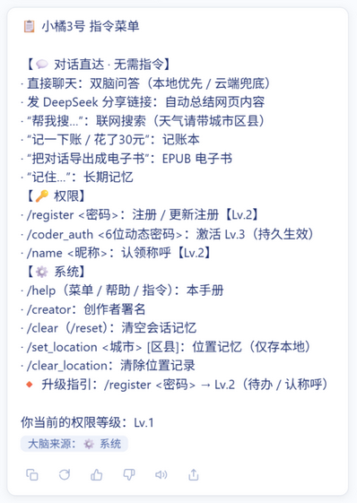

# 小橘3号（xiaoju3-agent）· 四大创新点演示包

| 项 | 内容 |
| --- | --- |
| 项目 | 小橘3号（xiaoju3-agent）——住在家用设备里的私人 AI 管家 |
| 文档名 | 四大创新点演示包（DEMO_PACK） |
| 编制日期 | 2026-10-02（初版）/ 2026-10-05（通用刷新，同步至 v1.0.4） |
| 仓库 | https://github.com/Xun201/xiaoju3-agent（main） |
| 基线 | 84795c4（全仓 1874 passed + 4 skipped） |
| 用途 | 演示/评审四大创新点的"是什么 → 代码在哪 → 怎么验证"一页通；`[SCREENSHOT: …]` 为截图占位，补图后即为完整演示稿；亦可作参赛作品说明底稿（通用创新叙事，赛道定制另行叠加） |

状态标记沿用三份主文档口径：🟢 已实现（代码可核对）｜🟡 模块已就绪·接线中｜🔜 规划中。

## 总览

| # | 创新点 | 一句话 | 状态 |
| --- | --- | --- | --- |
| 1 | 物理安全底线 + 软件四级权限 | 物理开关绝对优先于一切软件等级（含 Lv.4），软件侧再叠四级门禁 + 儿童锁人在环路 | 🟢 |
| 2 | 设备自动迁移 / 灵魂备份 | 一个 zip 带走"自己是谁、记得什么"，新设备解包即活；多设备互相守望 | 🟢（/soul_export //soul_import 已落地，7b14fe2；PeerWatch 已接线，8ea0b8c） |
| 3 | 本地优先双脑 + 完整设备接管链 + 实时思维链 | 本地模型优先、云端兜底；同一具身体控手机、控家电、控文件；思考过程逐段实时可见 | 🟢 |
| 4 | QQ 家庭入口 + 桌宠人格 + 待办管家 + 控制台第二入口 | 全家人用现成的 QQ 就能召唤它；甩个链接自动提炼待办；网页控制台全功能操作面 | 🟢（桌宠已回归上线，与加速球共存） |

---

## 创新点 1：物理安全底线 + 软件四级权限 🟢

### 是什么

两件事拧成一条安全链：

1. **物理安全底线（凌驾一切）**：功能文档 §8.0 把它列为最高优先级——"所有危险设备必须保留独立的物理机械开关。本项目的软件智能控制仅作为辅助，物理开关的优先级绝对高于任何软件权限等级。"无论软件处于哪个等级（包括 Lv.4 主人级），物理开关都能直接切断危险设备；软件失效、被绕过或误动作时，它是最后保障。
2. **软件四级权限（Lv.1→Lv.4 递进继承）**：架构文档 §6（2026-10-02 重构定稿）——Lv.1 路人（聊天/搜索）→ Lv.2 普通用户（写文件/列目录，`/register` 密码）→ Lv.3 代码编写者（改代码 + 安全家居六类 domain，`/coder_auth` TOTP）→ Lv.4 主人级（危险设备 lock/valve/阀 + ADB 全套 + 发图 + 重启自身 + 装卸组件 + 核心记忆，`/lv4_auth confirm` 授权级验证）。高级自动包含低级全部能力。

再往上的 insurance 是**儿童锁（批次②）**：`CHILD_LOCK_ENABLED=true` 时，被登记为儿童的用户触发**危险家电**（门锁/燃气阀等）控制 → 工具不执行，挂起请求并向"在线成人 Lv.4"（最近 5 分钟内交互过且等级 ≥4）QQ 私聊推送 🔒 请求，成人回 `/approve`（以主人级权限代为执行）或 `/deny`；5 分钟超时或无在线成人 → 直接拒绝。网页控制台视为成人设备。成人标记按 user_id 存 `agent_state/identity.json` 的 `is_adults` 映射，缺省成人（绝不因旧数据把人锁在外面）。

### 代码位置

| 证据 | 位置 |
| --- | --- |
| 能力→最低等级矩阵 `ACTION_LEVELS`（14 个能力键，含注释"物理开关绝对优先"的体系落位） | `permission.py:67-82` |
| 继承语义判定 `has_permission`（level ≥ 门槛即过） | `permission.py:202-207` |
| 三档工具门禁清单 `_LV2_TOOLS` / `_LV3_TOOLS` / `_LV4_TOOLS` | `tools.py:78-84` |
| `execute_tool` 前置门禁（Lv.2/Lv.3/Lv.4 逐一拦截，拒绝文案附升级引导） | `tools.py:284-303` |
| 危险实体判定与 domain 自动路由（lock.*/gas/valve/阀 + `DANGER_ENTITIES` 白名单 → Lv.4；六类安全 domain → Lv.3） | `home_tools.py` `is_dangerous_entity()`；`tools.py` `control_ha_device` 分支 |
| 儿童锁总开关（env） | `xiaoju3.py:145` `CHILD_LOCK_ENABLED` |
| 儿童锁流程：在线成人判定 / QQ 私聊通知 / 挂起-裁决包装器 | `main.py:183-258`（`_is_online_adult_lv4` / `_notify_online_adults` / `_smart_ask_with_child_lock`） |
| 文档锚点 | 功能文档 §8.0（功能文档.md:131-135）；架构设计文档 §6（架构设计文档.md:193-215） |

### 可验证证据

- **离线可复跑**：`tests/test_permission.py`、`tests/test_tools.py`、`tests/test_home_tools.py` 全绿（全仓 1874 passed + 4 skipped 内）。
- **现场演示脚本**（QQ 端三连）：
  1. Lv.1 账号说"把工作区里写个 test.txt" → 工具门禁拒绝并引导 `/register`；
  2. `/coder_auth <动态密码>` 升 Lv.3 → 控"客厅灯"成功；说"开车库门"（危险实体）→ Lv.4 拒绝文案；
  3. 开 `CHILD_LOCK_ENABLED=true` + 子账号登记 `is_adult=false` → 子账号让"开燃气阀" → 成人 QQ 私聊收到 🔒 请求 → 回 `/approve` 才执行（或 `/deny`/超时拒绝）。
- **物理底线当场证伪法**：任意 Lv.4 状态下，直接按下家电的物理开关——永远有效。软件等级再高也"夺不走"这道控制权，这就是 §8.0 的可演示形态。

### 为什么业内无第二家把"物理开关绝对优先"写进权限体系

- **主流竞品的权限是"账号-云端"模型**：小爱/天猫精灵/小度/HomeKit/Siri 的家庭权限解决的是"谁能对音箱说话"，安全兜底靠云端风控与免责条款；物理开关在它们的体系里是"用户自己注意事项"，不是权限矩阵之上的**不可变约束**。
- **小橘3号把它写成了体系的第一公理**：文档层面 §8.0 列为最高优先级；代码层面危险实体自动路由到最高门禁（Lv.4）、儿童锁再叠一层"人在环路"裁决——软件四级再高，自认"上限"，物理层永远在它之上。这是把"家中最后一道控制权永远属于人"产品化为可执行规则。
- **它是家庭场景的信任基础**：老人不会用 App、停电断网软件全瞎、AI 误触发——三种场景下家庭成员都还有 100% 确定性的手段。评审者可用"当场证伪法"验证，这是竞品给不出的演示。
- **远期规划一提**：强制自愈（Recovery Mode）——系统遭病毒入侵后，LV4 生物认证 + 只读签名通道强制重装自身（🔜 安全前提完备后再评估，详见功能文档 §12 路线图）。

> 📷 截图占位 [SCREENSHOT: 儿童锁三连——子账号请求开燃气阀的 QQ 对话 + 成人私聊收到"🔒 儿童操作请求" + 回复 /approve 后执行结果]

---

## 创新点 2：设备自动迁移 / 灵魂备份 🟢（/soul_export //soul_import 已落地）

### 当前状态

- **代码已落仓库**：`migration.py`（设备自动迁移 + 多设备互相守望模块）——
  - `export_bundle(path=None)`：把"自己是谁、记得什么、喜欢什么、设置成什么样"打包为单一 zip（`xiaoju3_soul_*.zip`）；密钥**不进包**，包内 `MANIFEST.txt` 只列应手工迁移的配置键名（不含值）；
  - `import_bundle(zip_path, overwrite=False)`：解包恢复到 `agent_state/`；冲突默认跳过；成员路径防穿越（绝对路径 / `..` 一律拒绝）；
  - `PeerWatch`：对端列表 env `XIAOJU3_PEERS`（逗号分隔 http://host:port），逐个 GET `/api/health`（3 秒超时），连续 3 次失联触发 `on_peer_down` 回调——默认中文告警 + 自动 `export_bundle` 留最新备份，**不自动抢班**（抢班交给部署编排层，本模块提供钩子）；
  - `health_bp`：`/api/health` Flask Blueprint，已注册于 `xiaoju3_dashboard.py:72,80`（:5003 可被对端探测）。
- **已接线部分**：`/api/health` 端点 🟢；PeerWatch 守护线程挂进 `main.py` `start_background_services()`（**主入口 env `PEER_DEVICE_URL` 配置即启用**，多对端扩展 `XIAOJU3_PEERS`+`XIAOJU3_WATCH=1` 口径不变；8ea0b8c）🟢；`xiaoju3_soul_*.zip` 已进 `.gitignore` 🟢。
- **灵魂指令已落地（2026-10-02，7b14fe2）**：QQ 指令 `/soul_export`（Lv.3+，默认落 `backups/soul_<时间戳>.zip`）与 `/soul_import`（Lv.4，MANIFEST.json 强校验 + 覆盖式恢复 + 安全警告回复）；经 `main.handle_soul_command` 指令分流，`[指令路由]` 日志自动覆盖。注意：灵魂包为 **.env 配置项快照随包**（含密钥，仅限家庭内网迁移），与旧 `export_bundle`"密钥不进包"口径不同——旧函数保留供 PeerWatch 留备份。

### 要迁移的核心数据

| 数据 | 实际位置 | 内容 | 策略 |
| --- | --- | --- | --- |
| `identity.json` | `agent_state/identity.json` | 权限等级、Lv.4 主人标记、用户称呼、儿童锁 `is_adults` 映射 | 打包 |
| `history_qq.json` | `agent_state/history_qq.json` | QQ 通道对话记忆 | 打包 |
| `history_web.json` | `agent_state/history_web.json` | 网页控制台通道对话记忆 | 打包 |
| `history_cli.json` / `history_console.json` | `agent_state/` | 终端 / 控制台通道记忆（`history_*.json` 通配全打包） | 打包 |
| `conversations/` | `agent_state/conversations/` | 会话明细 | 打包 |
| `long_term.db` | `agent_state/long_term.db` | SQLite 长期记忆库（memories 表） | 打包 |
| `emoji_links.json` | `agent_state/` | 表情包链接收藏库 | 打包 |
| `.env` 配置项 | `xiaoju3_data/.env`（隔离区，gitignore） | `DEEPSEEK_API_KEY`、`HA_URL`/`HA_TOKEN`、`ONEBOT_API_URL`/`ONEBOT_TOKEN`、`XIAOJU3_TOTP_SECRET`、`XIAOJU3_REGISTER_PASSWORD`、`DANGER_ENTITIES` 等 | **不打包**——`MANIFEST.txt` 只列键名，值由用户在新设备手工核对 |

### 一键导出 / 导入接口草图（10-04 落地口径）

```python
# ===== 已就绪（migration.py 实测签名）=====
export_bundle(path=None)                    # → xiaoju3_soul_YYYYMMDD_HHMMSS.zip
import_bundle(zip_path, overwrite=False)    # → 恢复 agent_state/，防穿越校验
PeerWatch().watch_loop(interval=60)         # → 失联 3 次触发 on_peer_down（默认自动留最新备份）

# ===== 已落地（2026-10-02，7b14fe2）：QQ 指令 =====
#   /soul_export [路径]          （Lv.3+）→ export_soul_bundle()：backups/soul_<时间戳>.zip
#                                 回复包路径 + 大小 + 包含项摘要（.env 为配置项快照）
#   /soul_import <zip绝对路径>   （Lv.4）→ import_soul_bundle()：MANIFEST.json 强校验
#                                 后覆盖式恢复；回复含 [安全警告] + 建议重启生效
# ===== 仍未实现（保持规划）=====
# ② HTTP API（:5003）——未实现（网页控制台入口已随 C' 接线：
#   /soul_export、/soul_import 控制台直达，22d9980）
# ③ CLI——migration.py 自带 __main__ 仅覆盖旧口径函数（export_bundle/import_bundle）
# ④ 守望联动（已留钩子）：on_peer_down → 告警日志 + export_bundle 留最新备份；
#   新设备拉起后 /api/health 恢复心跳，PeerWatch 快照翻绿
```

### 可验证证据

- 离线：`tests/test_migration.py`（导出/导入/防穿越/守望探测）全绿。
- 现场（已落地）：QQ 发 `/soul_export` → 把 zip 拷到新机 → `/soul_import` → 重启后身份、等级、记忆原样续聊（导出链已生产验证）。

> 📷 截图占位 [SCREENSHOT: /soul_export 的 QQ 回复（含 xiaoju3_soul_*.zip 路径与大小）+ 新设备 /soul_import 后"我是谁/记得什么"续聊对比]

---

## 创新点 3：本地优先双脑 + 完整设备接管链 🟢

### 是什么

**双脑**：每条消息先进 `brain.smart_ask`（brain.py:1635 起）——本地 Ollama 优先、云端 DeepSeek 兜底、异常热切换，用户无感。**接管链**：同一个大脑的输出可落成三类执行——控手机（ADB）、控家电（Home Assistant）、控文件（工作区沙箱），全部走同一张工具白名单与同一套四级权限门禁。

`smart_ask` 流程（可对照源码逐步讲）：

1. 长期记忆关键词提取落库（`_remember_user_facts`，brain.py:1647）；
2. 位置隐私静默期硬拦截：位置未知 + 地点敏感问题 → 不进模型，代码层强制询问（brain.py:1654-1669）；
3. 消息含 URL → 先抓网页正文（剔除 script/style）再总结（brain.py:1671-1696）；
4. 组装上下文：前情提要压缩（>20 条浓缩）→ 长期记忆注入 → 位置状态注入（brain.py:1673-1681）；
5. 防死循环熔断：已熔断会话剥夺本轮工具调用权（brain.py:1700-1702）；
6. **硬件自适应路由**：低配设备跳过本地探测直接云端（省 1 秒）；中配在线则优先小模型；否则探测本地 Ollama（1 秒超时）→ 在线走 `ask_local`，异常自动切 `ask_cloud`（brain.py:1704-1735）；
7. 回复含工具 JSON → 正则提取 → 白名单校验 → `execute_tool` 执行 → 结果喂回模型生成自然语言答复，全程 `<think>…</think>` 包装供前端推理卡片。

### 代码位置

| 证据 | 位置 |
| --- | --- |
| `smart_ask` 双脑决策入口 | `brain.py:1635` |
| 本地探测 / 热切换 / 硬件分档 | `brain.py:1704-1735`（`probe_local` / `_resolve_tier` / `ask_local` / `ask_cloud`） |
| 终端日志"🏠 本地大脑在线，优先使用本地算力！" | `brain.py:1717`（🧩 medium 档 `:1715`；📱 low 档 `:1709`；📡 云端 `:1719`） |
| 工具白名单 `TOOL_WHITELIST` | `brain.py:146-153` |
| 工具执行唯一入口与分级门禁 | `tools.py:276` `execute_tool`（门禁 `:284-303`） |

### 15 项工具白名单（tools.py:71 `TOOL_WHITELIST = tool_registry.whitelist_names()`）

> 注：创新点立项时白名单为前 10 项；1.0 冲刺扩至 14 项；2026-10 待办提取线加入 `extract_todos` 后为 **15 项**（实调 `from tools import TOOL_WHITELIST` 核对）。派生机制已升级：白名单/等级分组/高危集合全部由 `tool_registry` 统一登记表派生（2026-10-04 架构边界批次，单一事实源）。如实列出：

| # | 工具 | 接管对象 | 门禁 |
| --- | --- | --- | --- |
| 1 | `list_files` | 文件 | Lv.2 |
| 2 | `read_file` | 文件 | Lv.2 |
| 3 | `write_file` | 文件 | Lv.3 |
| 4 | `get_ha_devices` | 家电（读六类实体） | Lv.1+（能力键） |
| 5 | `control_ha_device` | 家电（开关/切换；危险实体自动升 Lv.4） | Lv.3 / Lv.4 |
| 6 | `adb_screenshot` | 手机 | Lv.4 |
| 7 | `adb_tap` | 手机 | Lv.4 |
| 8 | `adb_swipe` | 手机 | Lv.4 |
| 9 | `vision_tap_element` | 手机（云端视觉点击兜底） | Lv.4 |
| 10 | `ui_tap_element` | 手机（uiautomator 元素精准点击） | Lv.4 |
| 11 | `web_search` | 联网搜索 | Lv.1 |
| 12 | `system_manage` | 系统组件装卸 | Lv.4 |
| 13 | `read_core_memory` | 核心记忆库 | Lv.4 |
| 14 | `restart_service` | 重启小橘自身进程（无 OS 级调用面） | Lv.4 |
| 15 | `extract_todos` | 待办提取（链接→后台抓取→分片提炼入库） | Lv.1+（链接受理） |

### 可验证证据

- **终端日志**：本地在线时启动/对话可见 `🏠 本地大脑在线，优先使用本地算力！`（brain.py:1717）——截图占位见下。
- **离线**：`tests/test_brain.py`（双脑切换、白名单校验、熔断）、`tests/test_tools.py`（分级门禁）全绿。
- **现场演示**：拔网线（断云端）→ 群里继续对话——本地大脑独立成事（家电控制经云端统一路由，断网时暂不可用）；插回网线无感恢复。

### 实时思维链：双脑链路的真流式（2026-10-05，v1.0.4 主打）🟢

#### 是什么

上述双脑链路的"实时化"升级：控制台对话不再"转圈等整段回复"，而是 **DeepSeek 式逐段实时展开**——思考过程卡片随模型输出逐段增长（`[思考]/[计划]/[行动]` 分段可见），工具执行间隙卡片内插"🔧 正在执行工具"行，回答增量写入正文，完成后走既有折叠节奏。模型两端原生流式（Ollama NDJSON / DeepSeek SSE），中间层为 Flask SSE 五事件协议（`think/tool/answer/done/error`），前端 `fetch + getReader()` 手解；**流式失败自动回退旧一次性链路（口径零回退）**，QQ 通道与 `/api/chat` 原样保留零风险并存。

**实测性能**（2026-10-05，本地 Ollama 热模型）：首事件 **0.09~0.73s**（逐段观感远优于冷启动预估）；流式进行中并发轮询 `/api/status` 恒 0.505s——流式占线程不阻塞其他请求（ThreadingWSGIServer 多线程实证）。

#### 代码位置

| 证据 | 位置 |
| --- | --- |
| 双脑流式消费器（Ollama NDJSON / DeepSeek SSE，`iter_lines` 逐行） | `brain.py:1890` `_ask_local_stream` / `brain.py:1918` `_ask_cloud_stream` |
| `smart_ask_stream`（复刻同步版全状态机，on_event 回调吐增量） | `brain.py:1956` |
| SSE 端点：生产者线程 + queue 桥接，五事件协议 | `xiaoju3_dashboard.py:883` `api_chat_stream`（:968 `Response(generate(), mimetype="text/event-stream")`） |
| 指令拦截复用（/help 等斜杠指令在流式通道不进模型） | `xiaoju3_dashboard.py:917`（生成器起始处，单帧 done 收口） |
| 前端渐进渲染：getReader 手解 + 逐段 append + 末行整刷 | `console.js:1218` `sendMessageStream` / `:1258` `renderThinkProgressive` |
| 断流回退：半途断流闭包内清过程件再转旧路重答 | `console.js:1354` `sendMessageLegacy`（回退路径） |

#### 可验证证据

- **离线**：`tests/test_chat_stream.py`（SSE 协议/错误事件/回退/拦截/渐进锚）全绿；流式与同步输出逐字节一致锚。
- **现场**：控制台发一条消息 → 思考卡标题带"（实时）"字样、内容随生成逐段增长 → 完成后自动折叠为完整卡片。断网半途 → 残件清理+自动转旧路重答。
- **性能**：首 token 数据见上文实测（本地 0.1~0.7s；云端受理即回亚秒级）。

![实时思维链——完成后展开态（思考卡 [思考]/[计划] 分段；增长过程因本地热模型生成亚秒级，录屏可证）](img/demo_05_streaming.png)

### 本地模型 + 控手机 + 控家电 + 控文件，为什么这个组合稀缺

- **纯本地方案（Ollama 生态、各类"本地助手"）**：只有聊天，没有执行臂——能说不能做；
- **云端助手（小爱/小度/Siri/音箱家族）**：有执行臂，但大脑在云、数据出门、断网即聋，且能力被厂商白名单锁死；
- **开源家居中枢（Home Assistant 系玩法）**：控家电强，但"控手机（ADB 三原语 + UI 元素解析 + 视觉点击三级点击链）""控文件（realpath 沙箱）"与"本地大脑"不在同一具身体里，更没有统一的四级权限与儿童锁。
- **小橘3号把四件事装进同一具家用单体**：一个 `smart_ask` 出口、一张白名单、一套权限矩阵——本地优先保证"数据不出家门 + 断网可用（对话；家电控制经云端路由）"，执行臂保证"说得算数"。单看每一项都有人做，**四合一 + 统一权限**目前没有第二家。

> 📷 截图占位 [SCREENSHOT: 终端日志"🏠 本地大脑在线，优先使用本地算力！"整屏（含启动横幅与一条本地应答)]

---

## 创新点 4：QQ 家庭入口 + 桌宠人格 🟢

### 是什么

**QQ 入口**：QQ 侧经 OneBot 11 协议接入（NapCat / LLOneBot 自托管实现），webhook 宿主于 `:5003` 控制台进程的 `/onebot` 路由，业务体为 `main.py` 纯函数 `onebot_event(data)`——收到消息 → 清洗 → `handle_message` 路由 → 回复发回（`send_group_msg` / `send_private_msg`）。私聊直接响应；群聊需 @（含纯文本 @ 形态）或触发词（小橘/小桔/橘3号/橘三号/AI测试）防刷屏；还有"戳一戳"彩蛋（会痒得回话）。

**桌宠人格**：`desktop-pet.js`（598 行，IIFE 单例注入）——Q 版橘色狐狸娘挂在网页控制台右下角：Pointer Events 拖拽 + 按压形变、距屏幕左右边缘 <24px 磁吸贴边、`scaleX(-1)` 左右翻转（始终朝屏幕中心）、**双版本状态机**（吸附时半身像 `normal_half.png` 只露上半身，拖拽中自动切全身像 `normal_full.png`，素材缺失逐级回退绝不裂图）、随机台词气泡与余额轮换、WebAudio 程序合成音效（零音频文件）、移动端视口自动缩放。`PET_STATE_IMAGES` 常量表即情绪扩展接口（新增情绪 = 补素材 + 表内登记）。

**现状注记（如实）**：桌宠 JS 功能齐备，已于 2026-10-02 回归上线（`index.html` 重新挂载 `desktop-pet.js`）；加速球仅最小化态显示（`body.xiaoju3-minimized`），二者共存互不依赖。`assets/pet/normal_half|full.png` 目前为 JPG 占位字节，待替换为即梦 AI 生成的透明 PNG。

### 代码位置

| 证据 | 位置 |
| --- | --- |
| OneBot 11 webhook 业务体（消息处理 / 戳一戳彩蛋 / 单条异常不崩接入层） | `main.py:750-815` `onebot_event` |
| webhook 宿主（:5003 `/onebot`，LLOneBot/NapCat 上报地址） | `xiaoju3_dashboard.py`（路由）+ `main.py:75`（端口 3001 口径注释） |
| 群聊 @/触发词过滤（纯文本 @ 形态兼容） | `main.py:18,140-144,650-670` |
| NapCat 静默拉起 | `setup_napcat.bat`、`start_napcat_silent.vbs` |
| 桌宠实现（贴边/翻转/双状态机/台词/音效） | `desktop-pet.js:1-27`（能力头注）、`:33-37`（`PET_STATE_IMAGES`）、`:131`（翻转层） |
| 桌宠前端停载现场 | `index.html:538-543` |
| 离线测试 | `tests/test_pet_desktop.py`、`tests/test_pet_edge_frontend.py` 全绿 |

### 中国家庭场景下，QQ 作为 AI 入口的天然优势

1. **零安装门槛**：爸妈爷奶手机里已经有 QQ。AI 入口不是"再装一个 App"，而是"加个好友"——家庭 AI 落地最大的一步被抹掉了。
2. **家庭群 = 天然多用户系统**：一家人本来就在一个群里；@小橘3号 即召唤，触发词防刷屏，而权限等级、儿童锁成人登记全部按 QQ user_id 逐人管理——客厅音箱做不到"按人分级"，QQ 天然做得到。
3. **私聊推送是现成的"家庭协同总线"**：创新点 1 的儿童锁裁决（成人 QQ 私聊收 🔒 请求 → `/approve` / `/deny`）全靠它闭环，不需要任何额外通知渠道。
4. **协议生态成熟且自托管**：OneBot 11 + NapCat/LLOneBot 全家桶本地部署、不依赖厂商云——与"数据不出家门"的产品原则严丝合缝。
5. **入口即人格**：戳一戳会痒、桌宠会翻面、回复带 Edge-TTS 语音——QQ 不只是遥控器，是这只橘色狐狸娘"住在"的地方。

> 📷 截图占位 [SCREENSHOT: 双拼左=QQ 群 @小橘3号 对话（含戳一戳彩蛋），右=控制台右下角桌宠半身吸附 + 台词气泡]

### 待办管家：QQ 甩链接，自动提炼与管理（2026-10 待办线）🟢

#### 是什么

家庭场景的高频动作"**把这个分享链接记下来**"被产品化：QQ 里发一条 `chat.deepseek.com/share/…` 链接 → 受理即回"丢给后台去啃" → 后台 Playwright 无头抓取对话正文（零可见窗口）→ 长文分片提炼 → **优先级六档（P0-P5，时间尺度分层判据）自动判级入库** → 控制台待办面板分区展示。管理闭环：分区折叠（服务端持久化）、每条可挂"淡淡说明"（折叠/展开/编辑）、单条硬删（垃圾桶图标+二次确认）、24 小时持久查重（同链接不重复提取，清空指令可重置）。

**拆库设计**：待办库（todos.db）与长期记忆/身份/对话历史分离——测试版与正式版**共用同一份待办**，而各自的"灵魂"（身份/记忆）互不干扰。

#### 代码位置

| 证据 | 位置 |
| --- | --- |
| 提取编排：抓取 → 分片提炼 → 容错解析 → 入库 → 任务状态 | `plugins/todo_extractor.py:167` `extract_todos_from_url`（:220 同步封装） |
| 分片提炼 prompt（提示注入主防线） | `plugins/todo_extractor.py:88` |
| 待办库路径（env 可指共享库，缺省向后兼容） | `agent_state/state_manager.py:46` `self.todos_db` |
| 单条硬删 API（DELETE 方法，与写系 POST 区分） | `xiaoju3_dashboard.py` `api_todo_delete`（DELETE /api/todos/&lt;id&gt;） |
| 前端面板：六档分区/折叠/说明/垃圾桶 | `console.js` renderTodos / click 委托 |

#### 可验证证据

- **离线**：`tests/test_todo_extractor.py`、`tests/test_todos_db.py`、`tests/test_state_manager.py` 全绿。
- **现场**：QQ 发分享链接 → 受理回复 → 稍后控制台面板出现新条目（带自动判级）；同链接 24h 内重发被持久查重拦截。


### 网页控制台：第二入口（QQ 之外的全功能操作面）🟢

#### 是什么

`:5003/console` 单页控制台是 QQ 之外的完整操作面：**流式对话**（见创新点 3）、**斜杠指令全面接线**（11 条指令控制台直达——`/help` 七分类菜单、`/lv4_auth` 两步流、`/soul_export`、`/todos` 等，命中即走本地函数**不进模型**，零幻觉零等待）、**待办面板**（见待办管家）、桌宠人格与系统状态卡。指令接线与 QQ 通道共用同一套权限等级（全局单例 identity.json），控制台视为成人设备。

#### 代码位置

| 证据 | 位置 |
| --- | --- |
| 斜杠指令拦截器（清单 ⊆ main.handle_message，复用既有函数） | `xiaoju3_dashboard.py:1070` `_console_slash_intercept`（:843 api_chat、:917 stream 双通道挂载） |
| 控制台流式/回退（同创新点 3） | `console.js:1218` / `:1354` |

#### 可验证证据

- **离线**：`tests/test_dashboard.py`（指令拦截锚/清单一致性/等级门真实拒绝）、`tests/test_console_slash.py` 全绿。
- **现场**：控制台输入 `/help` → 七分类菜单即时返回（大脑来源徽标"⚙️ 指令"）；输入普通消息 → 走流式对话。



---

## 附：演示前检查单

- [ ] `.env` 就位：`XIAOJU3_TOTP_SECRET`（Lv.3/Lv.4 提权）、`HA_URL`/`HA_TOKEN`（家电演示）、`ONEBOT_API_URL`（QQ 演示）
- [ ] 本地 Ollama 在线（创新点 3 的 🏠 日志与断网演示）
- [ ] `CHILD_LOCK_ENABLED=true` 且儿童/成人两账号就位（创新点 1 三连演示）
- [ ] 四张 `[SCREENSHOT: …]` 补图完成
- [ ] 全仓测试基线：`python -m pytest -q`（1874 passed + 4 skipped）
