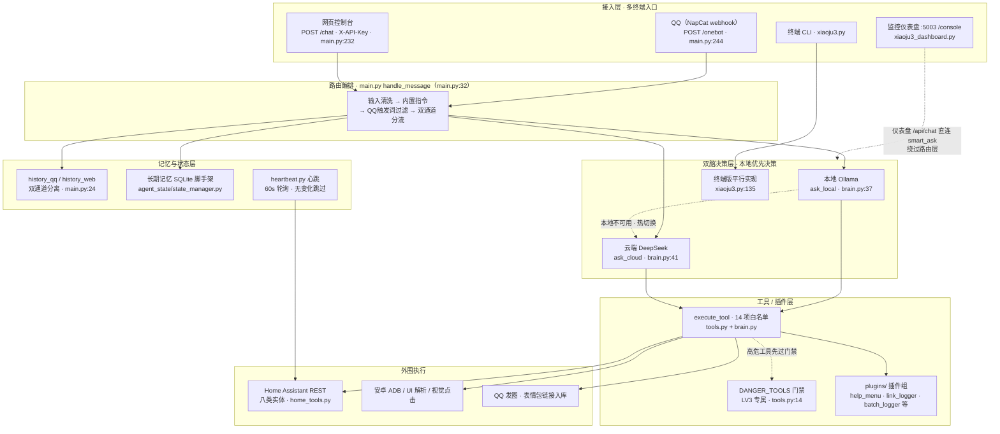
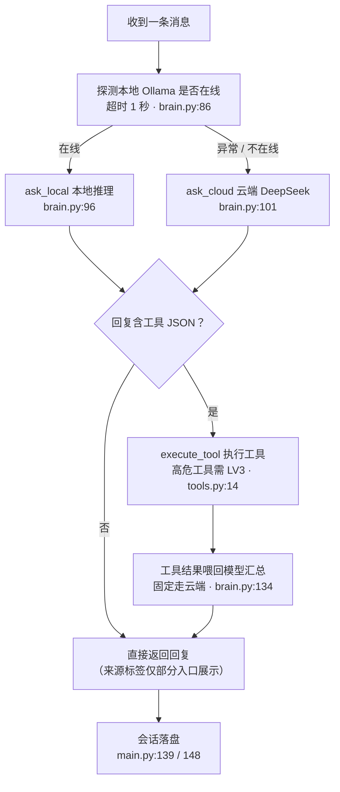
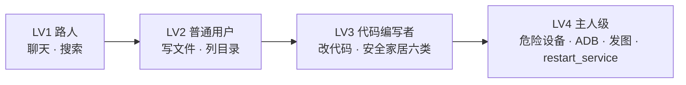

# 小橘3号（xiaoju3-agent）架构设计文档

| 项 | 内容 |
| --- | --- |
| 项目 | 小橘3号（xiaoju3-agent） |
| 文档名 | 架构设计文档 |
| 更新日期 | 2026-09-29 |
| 仓库 | https://github.com/Xun201/xiaoju3-agent |
| 开源协议 | MIT（产品口径；仓库内 LICENSE 文件暂缺 🔜 待确认） |

> 状态标记：**🟢 已实现**（仓库代码可核对，附代码位置）｜**🟢 已实现·未接线**（代码存在但调用链未启用）｜**🔜 规划中**（产品介绍已提出、当前代码未见实现）｜**🔜 待确认**（暂无法确认）

## 1. 设计目标与原则

小橘3号是一个"住在家用设备里"的私人 AI 智能体：有自己的名字、性格与橘色狐狸娘形象，可通过 QQ、网页控制台与终端 CLI 对话，能读写工作区文件、抓取网页总结、控制智能家居、精准接管安卓手机。架构围绕五条原则设计：

| # | 原则 | 含义 | 现状 |
| --- | --- | --- | --- |
| 1 | 本地优先决策 | 每条消息先交给本地模型，本地不可用或无法胜任时热切换云端 DeepSeek，过程对用户透明 | 🟢 brain.py 每条消息先探测本地 Ollama，异常才转云端（brain.py:82-101） |
| 2 | 数据不出家门 | 会话记忆、设备状态、密钥全部留在本地设备与隔离区，上传仓库前经隐私门禁 | 🟢 记忆落本地 JSON（main.py:24-28）；push.sh 四道扫描（push.sh:21-84）；🟢 灵魂备份 /soul_export //soul_import 已落地（§8） |
| 3 | 插件化 | 读写文件、抓网页、发图、控家居均为独立工具/插件，加功能不改主程序 | 🟢 tools.py 工具白名单 + plugins/ 插件组（部分插件未接线，见 §5） |
| 4 | 多终端可部署 | 香橙派、电脑、手机、NAS 等算力达标终端皆可承载 | 🟢 shell 守护脚本部署（start.sh）；🟢 灵魂备份迁移已落地（§8）；🔜 自动重启续服仍规划 |
| 5 | 最低算力门槛 | 本地侧跑 Ollama 小模型（qwen2.5:7b，xiaoju3.py:17），云端只做兜底，无独立显卡的家用终端也能运行 | 🟢 本地探测 + 云端兜底已实现 |

## 2. 总体架构

后端为 Flask 单体：main.py 同时承载 QQ 与网页两个消息入口，统一进入 handle_message 后交 smart_ask 做"本地 Ollama 优先、DeepSeek 兜底"的双脑决策与 JSON 工具调用；监控仪表盘独立为 xiaoju3_dashboard.py（5003 端口）；终端 CLI 为 xiaoju3.py。

> 图注：监控仪表盘的聊天接口（xiaoju3_dashboard.py:245）直接调用 brain.smart_ask（xiaoju3_dashboard.py:6 从 brain 导入），不经过 main.py 的 handle_message 路由层，也不写 QQ/网页双通道记忆。

**分层职责对照**：

| 层 | 主要代码 | 职责 | 现状 |
| --- | --- | --- | --- |
| 接入层 | main.py（QQ+网页，5002）、xiaoju3_dashboard.py（5003）、xiaoju3.py（CLI） | 收消息、鉴权、托管网页 | 🟢 |
| 路由层 | main.py handle_message | 标点清洗 → 内置指令 → 触发词过滤 → 按来源分记忆通道 | 🟢 main.py:32-151 |
| 双脑层 | brain.py smart_ask | 本地优先决策、云端兜底、工具 JSON 解析 | 🟢 |
| 工具/插件层 | tools.py + plugins/ | 10 项工具白名单、高危门禁、插件扩展 | 🟢 |
| 记忆与状态层 | history_*.json、agent_state/、heartbeat.py | 会话记忆、长期记忆脚手架、心跳 | 🟢 / 部分未接线 |
| 外围执行 | home_tools.py、adb/android_ui/vision_tools、emoji_manager.py | Home Assistant REST、安卓接管、QQ 发图 | 🟢 |

**进程角色**：

| 进程/脚本 | 角色 |
| --- | --- |
| main.py | QQ 机器人本体 + 内置简版网页控制台（5002 端口，main.py:294） |
| xiaoju3_dashboard.py | 独立监控仪表盘（5003 端口，/console）：CPU/内存/温度、余额、聊天（xiaoju3_dashboard.py:257） |
| xiaoju3.py | 终端 CLI + 双脑配置源（本地/云端地址、模型、记忆上限、工作区均在此定义）；内含与 brain.py 平行的一套 ask_local/ask_cloud/smart_ask（xiaoju3.py:135-171） |
| xiaoju3_refresh.py | 动态 6 位确认码校验 → 重算 sha256 → systemctl 重启服务（systemd unit 文件未入库 🔜 待确认） |

**前端形态**（三套网页并存 🟢）：

- **新版控制台**：index.html + console.js + desktop-pet.js，由 xiaoju3_dashboard.py 经 /console 托管——左侧系统监控、右侧聊天双栏，2 秒轮询 /api/status，纯轮询无 WebSocket 🟢
- **桌面挂件（桌宠）**：desktop-pet.js 注入 DOM——右下角固定、Pointer Events 拖拽、边界钳制、按压动画、余额气泡（60 秒轮询 /api/balance）🟢；"左右翻转、吸附屏幕边缘、随机台词/图片气泡" 🔜 规划中
- **旧版单页**（xiaoju3_dashboard.py 内嵌，蓝色主题、含运行时长与来源标签）与 **main.py 内嵌深色聊天页**：历史形态并存 🟢
- 消息工具栏：复制、TTS 朗读、点赞/点踩（仅前端本地态，不落库）、刷新/转发为占位 🟢
- 移动端：新版控制台无 viewport/@media 适配，仅触控拖拽因 Pointer Events 天然可用 🔜 规划中
- 已知问题：/api/status 返回 temperature/timestamp，而旧版页读取 data.temp/data.uptime，字段不匹配（xiaoju3_dashboard.py:146-148 对 203-204）；"今日已用"后端恒为 0.0（xiaoju3_dashboard.py:223），气泡永远显示 ¥0.00；桌宠报错文案误写 5005 端口（实际 5003）

## 3. 双脑决策：本地优先决策

实现要点：

1. **本地探测**：每条消息先花约 1 秒探测本地 Ollama（地址硬编码为内网服务，brain.py:86）🟢
2. **热切换**：在线走 ask_local；探测失败或本地调用异常时自动转 ask_cloud（brain.py:94-101），用户无感，回复附来源标签（"🏠 本地"/"☁️ 云端"，smart_ask 返回 (回复, 标签) 二元组）🟢。标签当前仅在 5003 旧版页（xiaoju3_dashboard.py:172）与终端 CLI（xiaoju3.py:190）呈现——QQ 与 5002 内置网页端取 res[0] 丢弃该字段（main.py:135、144），主链路标签展示 🔜 规划中
3. **工具协议**：无 function calling；提示词要求模型"只输出一行 JSON"（prompts.py），正则提取 → 14 项白名单校验（brain.py TOOL_WHITELIST）→ execute_tool 执行 → 结果喂回模型生成自然语言回答 🟢
4. **云端收口**：工具结果汇总轮固定走云端 ask_cloud（brain.py:132-137）🟢
5. **终端版同构**：xiaoju3.py 内含平行的 smart_ask（本地优先 + 工具拦截，xiaoju3.py:135-171），其 ask_cloud 带最多 3 次重试（xiaoju3.py:116-133）🟢
6. **配置流向**：本地/云端地址与模型（LOCAL_URL/LOCAL_MODEL/CLOUD_URL/CLOUD_KEY 等）定义于 xiaoju3.py:15-22；CLOUD_KEY 经环境变量从隔离区 .env 读取（xiaoju3.py:9、21），不入仓库 🟢

**口径说明**：当前"本地优先决策"覆盖对话主链路与心跳决策（heartbeat._default_ask 本地优先、异常转云端）；工具汇总轮仍固定走云端，这是剩余张力点，列入路线图（§10）。输入含 URL 时会先抓网页正文再总结（brain.py）🟢；主动联网搜索已落地（search_tools.py 引擎降级链 + web_search 工具）。

## 4. 记忆与上下文管理

| 能力 | 实现 | 现状 |
| --- | --- | --- |
| 双通道分离存储 | QQ 会话写 history_qq.json、网页会话写 history_web.json，互不干扰（main.py:24-28） | 🟢 |
| 上下文保持 | 每轮携带历史消息进入模型，不会聊两句就"失忆"（main.py:132-149） | 🟢 |
| 记忆截断 | 保存时仅保留最近 MAX_MESSAGES=50 条（brain.py:28-29） | 🟢 |
| 前情提要压缩 | compress_context：超过 20 条时把旧消息浓缩为 50 字以内前情提要，本地优先生成、失败转云端（plugins/context_manager.py:1-41） | 🟢 已实现·未接线——全仓库无调用点，当前实际生效的是硬截断 |
| 长期记忆 | SQLite 库 long_term.db，含 memories 表与 save_memory/get_recent_memories（agent_state/state_manager.py:13-44） | 🟢 脚手架·未接线——对话链路仅调用 save_conversation 落盘最近 50 条 JSON（state_manager.py:46-50，main.py:140、149） |
| 身份与等级记忆 | 读写 identity.json 的机制已写好（load_identity 启动时读取，save_identity 落盘，permission.py:21-38），但 save_identity 全仓库无调用点——/coder_auth 升级仅内存赋值（main.py:54），不落盘，重启后等级回落；若等级落盘依赖隔离区私有扩展，开源版不含该模块（见 §6） | 🟢 已实现·未接线——等级持久化接线列入 §10 |

结论：产品口径中的"会压缩记忆"，当前以"50 条硬截断"方式实现；真正的"前情提要压缩器"已写好但未接入主链路，接线为近期规划（§10）。

未来将接入基于 RAG 的长期记忆与自我反思机制，以替代当前的 SQLite 脚手架。

## 5. 插件系统与意图路由

**工具层机制** 🟢：

- 唯一入口 execute_tool(tool_name, args)，if/elif 逐一分发（tools.py:12-78），无注册表
- 工具清单 14 项：list_files、read_file、write_file、get_ha_devices、control_ha_device、adb_screenshot、adb_tap、adb_swipe、vision_tap_element、ui_tap_element（原 10 项）+ web_search、system_manage、read_core_memory、restart_service（brain.py TOOL_WHITELIST，prompts.py 协议说明）
- 工作区沙箱：read/write 均以 realpath 前缀校验限制在 WORKSPACE 内（tools.py:24、33）；read_file 截断 1000 字符（tools.py:28）
- 安卓接管三件套：ADB 原语（adb_tools.py）、uiautomator XML 解析精准点击（android_ui_tools.py）、云端视觉模型点击（vision_tools.py，视觉模型名经配置项指定）
- 点击优先级：提示词规定有明确文字的元素必须先用 ui_tap_element，失败才回退 vision_tap_element（prompts.py:25）

**plugins/ 插件现状** 🟢：

| 插件 | 作用 | 状态 |
| --- | --- | --- |
| help_menu | /help 分级帮助菜单 | 🟢 在用（main.py:46-48） |
| link_logger | DeepSeek 分享页抓取（Playwright 打开并滚动触发懒加载） | 🟢 在用 |
| batch_logger | 长文按 4000 字分片逐片总结，"倒叙说书人"风格汇总 | 🟢 在用 |
| context_manager | 前情提要压缩器 | 🟢 已实现·未接线 |
| dev_logger | 旧版日志生成器 | 🟢 已实现·未接线（已被 link_logger + batch_logger 组合替代） |
| qq_send_image | QQ 发图封装 | 🟢 已实现·未接线（main.py:81-108 另有更全的内联实现） |

**开发日志自动生成链路** 🟢：QQ 发送 /gen_log <分享链接>（main.py:60-78，后台线程）→ 校验链接前缀 chat.deepseek.com/share/（run_link_log.py:15）→ Playwright 抓取完整对话 → 分片总结并按"倒叙说书人"风格撰写 → 自动编号 dev_log_N.md 并倒叙合并 ALL_LOGS.md（run_link_log.py:22-58）。"给它一个 DeepSeek 对话分享链接，能自己抓取内容、总结成开发故事（倒叙小说风格）"属实。

**表情包** 🟢/🔜：收到非 @ 图片时把图片 URL 追加进本地收藏（emoji_manager.py，main.py:111-120）——仅存链接不下载；[EMOJI:标签] 转 CQ 图片的 translate_emoji 已实现但未接入回复链（brain.py:143-151，无调用点）→ "发送已收藏表情"未闭环 🔜 规划中。

**规划中** 🔜：

- **自然语言意图路由**：介绍宣称"帮我记一下账""把这段对话导出成电子书"可直接听懂并调用——全仓库 grep 记账/电子书/导出无实现，无独立路由模块；语义级路由当前完全依赖模型自主输出工具 JSON，另有内置指令（/help、/coder_auth、/gen_log、/send_image）硬编码在 handle_message（main.py:46-108）
- **防死循环熔断**：介绍宣称"AI 反复尝试同一被拒操作时强制打断"——全仓库 grep 熔断/打断/interrupt 无实现；现有约束仅为每轮最多一次工具调用 + 高危工具权限门禁

## 6. 四级权限体系（2026-10-02 重构定稿）

权限按等级递进，高级包含低级全部能力：

| 等级 | 定位 | 能力范围 | 验证方式 | 现状 |
| --- | --- | --- | --- | --- |
| LV1 | 路人 | 基础聊天、联网搜索、读工作区文件（工作区沙箱 + 私有目录兜底） | 默认等级 | 🟢 |
| LV2 | 普通用户 | LV1 + 写工作区文件、列目录 | `/register <密码>`（env 校验） | 🟢 |
| LV3 | 代码编写者 | LV2 + 改代码、管理插件 + **安全家居**（六类 domain：input_boolean/light/switch/sensor/climate/media_player） | `/coder_auth <动态密码>`（env TOTP 校验） | 🟢 |
| LV4 | 主人级 | LV3 + **危险设备**（lock/valve/阀 + `DANGER_ENTITIES` 自定义白名单）+ **ADB 全套** + **发图** + **restart_service** + 装卸系统组件 + 核心记忆 | `/lv4_auth confirm <动态密码>`（授权级验证，TOTP env） | 🟢 |

- **门禁实现三档清单**（tools.py）：`_LV2_TOOLS = {read_file, list_files}`（execute_tool 前置门禁）；`_LV3_TOOLS = {write_file}`；`_LV4_TOOLS = {adb_screenshot, adb_tap, adb_swipe, ui_tap_element, vision_tap_element, send_image, restart_service}`（send_image 为能力声明，实际门禁在 main.py /send_image 指令）。
- **control_ha_device 按 domain 自动路由**（tools.py）：`home_tools.is_dangerous_entity()`（lock.*/gas/valve/阀 + `DANGER_ENTITIES` 环境变量精确白名单）为真 → `has_permission("control_dangerous_devices")`（LV4）；六类安全 domain → `has_permission("control_normal_devices")`（LV3）。
- **操作级双因子已删除**（2026-10-02）：LV4 危险操作不再要求 lv4_mfa_ok（TOTP+生物）与二次确认，安全边界收归 /lv4_auth 授权级验证 + 儿童锁（批次②：儿童锁开启时危险家电操作需在线成人 LV4 确认，identity.json 按 user_id 记录 is_adults 映射，缺省成人）。
- **restart_service**（新增，LV4 专属）：无参数、只重启小橘自身 Python 进程（先答复、2 秒后 os._exit，复活链 Linux=start.sh 守护 / Windows=桌面壳监督）；无操作系统级调用面。
- **发图限制**：/send_image 要求 LV4 且图片路径必须在项目工作区内。
- **注册名保护**：/register 称呼含英文字母 `xun`（大小写不敏感）即拒绝（创作者署名保护），中文谐音不限制。
- 预留私有扩展点：检测到隔离区扩展模块时以扩展权限管理器替换默认实例；该模块属隐私文件，开源版不含。

## 7. 心跳与主动服务

现状 🟢：

| 环节 | 实现 | 依据 |
| --- | --- | --- |
| 状态感知 | 每 60 秒轮询 Home Assistant /api/states，八类实体（六类 + binary_sensor + input_number，home_tools.HA_DOMAINS） | heartbeat.py、home_tools.py |
| 场景规则 | ①回家开灯（binary_sensor off→on + 灯 off）②空气干开加湿器（湿度<阈值），命中直接执行 0 token | heartbeat.py apply_scene_rules |
| 抖动免疫 | 时间型传感器（ISO 时间戳 state，如 sun.next_*）不参与快照对比；HA 探测失败错误串归一为常量（2026-10-02） | heartbeat.py _is_volatile_state / _default_sense |
| 变化检测 | 与上次快照比对，无变化直接跳过，不消耗 token | heartbeat.py |
| 主动决策 | 状态变化时先过场景规则，未命中唤醒大脑（本地优先，异常转云端） | heartbeat.py _default_ask |
| 主动执行 | 从决策中提取工具 JSON 并直接执行控制 | heartbeat.py |
| 凭证 | HA 地址与令牌（HA_URL/HA_TOKEN）从隔离区 .env 读取 | home_tools.py |

局限与规划：

- 决策本地优先（brain.ask_local，异常转 ask_cloud）——§3 口径说明；工具汇总轮仍走云端
- 仅支持开关型控制（turn_on/turn_off/toggle），"空调调到 26 度"这类细粒度控制做不到 🔜 规划中
- 场景规则①回家开灯、②湿度开加湿器已落地（apply_scene_rules，规则②已生产验证）；测试灯内置决策规则保留为规则未命中时的兜底口径
- 品牌接入（米家/飞利浦/涂鸦/海尔/美的/华为等）依赖用户在 Home Assistant 侧配置，仓库内无品牌协议代码 🔜 规划中（见 §10"全屋多品牌统一协议"）
- 未来将扩展为事件触发引擎与异步任务调度，支持情感计算与状态机

## 8. 部署架构

**部署单元**（🟢，shell 守护脚本族，无安装器）：

| 脚本 | 职责 | 依据 |
| --- | --- | --- |
| start.sh | 守护循环：异常退出 2 秒后自动拉起；stop.flag 文件为安全退出标记；可选加载隔离区私有 ADB 无线连接脚本 | start.sh:4-30 |
| secure_start.sh | 启动前 sha256sum -c 校验清单内核心文件，发现篡改拒绝启动 | secure_start.sh:5-8 |
| stop_all.sh | 密码确认后清理进程、释放 5001-5003 端口、停 napcat/homeassistant 容器 | stop_all.sh:13-31 |
| start_dashboard.sh | 后台启动监控仪表盘 | — |
| xiaoju3_refresh.py | 动态 6 位确认码校验后重算 sha256 并 systemctl 重启服务 | xiaoju3_refresh.py:10-40 |
| push.sh | 上传 GitHub 前四道隐私扫描（见 §9） | push.sh:21-84 |

**多终端可部署**：设计上任意算力达标终端（香橙派/电脑/手机/NAS）皆可承载——本地 Ollama + 云端兜底使无独显设备可运行（§1、§3）；当前部署形态为脚本守护 + 可选 systemd 服务（systemd unit 文件未入库 🔜 待确认）。

**一键部署** 🔜 规划中：介绍宣称"打包压缩包、双击安装、自动配置环境、自动启动、自动发 LV2 注册请求、升 LV3 弹 Root 式警告"——仓库无安装器、无 requirements.txt（README:30 引用但文件缺失，已核实）、无安装用 systemd unit；LV2 注册请求依赖的 /register 亦无处理器（§6）。

**设备自动迁移** 🟢 最小版已落地（2026-10-02）：migration.py 提供 export_soul_bundle / import_soul_bundle（MANIFEST.json 强校验、.env 配置项快照随包、成员路径防穿越），QQ 指令 /soul_export（Lv.3+）/ /soul_import（Lv.4）一键打包/恢复（main.handle_soul_command）；多设备守望 PeerWatch 已接线（env PEER_DEVICE_URL 配置对端，/api/health 探测，连续 3 次失联告警，不自动接管）。仍规划：故障自动接管（部署编排层）、新设备自动重启续服。

## 9. 安全与隐私设计

**已实现** 🟢：

| 机制 | 说明 | 依据 |
| --- | --- | --- |
| 工作区沙箱 | 文件读写 realpath 前缀校验，拒绝工作区以外路径 | tools.py:24、33 |
| 读取限幅 | read_file 截断至 1000 字符 | tools.py:28 |
| 高危门禁 | DANGER_TOOLS 四项需 LV3 | tools.py:14-16 |
| 启动完整性 | sha256 清单校验，篡改即拒绝启动 | secure_start.sh:5-8；manifest.txt / checksums.sha256 |
| 上传隐私门禁 | push.sh 四道扫描：①文件名黑名单（配置/密钥/身份/记忆/历史等）②明文 Key 内容扫描 ③git 历史遗留 Key 扫描 ④secret-time-machine 深度扫描（可选），命中即拦截回滚，人工确认后才推送 | push.sh:21-84 |
| 密钥本地化 | 模型密钥（DEEPSEEK_API_KEY）、HA 凭证（HA_URL/HA_TOKEN）均从隔离区 .env 读取，不入仓库 | xiaoju3.py:9、21；home_tools.py:6-9 |
| 身份与记忆隔离 | identity.json、记忆与对话文件置于 agent_state/ 与隔离区，且被 push.sh 黑名单覆盖（这也解释了开源版为何缺少部分私有文件） | push.sh:22 |
| 用户位置本地化（搜索指代消解） | 位置三级来源：.env `USER_CITY`/`USER_DISTRICT`（可选，模板留空）→ `agent_state/user_location.json`（gitignore；AI 主动询问后经回复内 `[LOCATION:城市-区县]` 标记或 `/set_location` 指令写入，`/clear_location` 清除）→ 均无则模型侧主动询问主人；位置不上传 GitHub、不传给云端（仅天气/本地搜索时用于拼接 query） | brain._inject_location / _resolve_user_location / _consume_location_marker；agent_state.state_manager.save_user_location |

**已知风险与改进项**（代码现状，如实列出）：

- /onebot QQ webhook 无任何鉴权（main.py:244），依赖内网环境 → 待加鉴权
- /chat 的 X-API-Key 硬编码于源码（main.py:21），且同一密钥写进前端 JS（main.py:206）→ 待外置为环境变量
- /coder_auth 认证码（main.py:53）与 stop_all 停止密码硬编码在源码 → 待外置
- 网页回复经 innerHTML 注入，存在 XSS 风险（console.js）→ 待转义
- 高危家居操作无实体级二次确认（§6）

**素材与协议**：

- 代码 MIT 协议（产品口径；仓库 LICENSE 文件暂缺 🔜 待确认）
- 橘色狐狸娘形象：AI 生成 + 人工后期编辑，著作权归作者，他人不可商用（产品口径）
- 音效/动图：规划采用 CC0 素材；当前仓库无任何音频/动图资源文件，"按压音效、任务结束提示音、每轮消耗弹窗"整体 🔜 规划中

## 10. 规划路线图

汇总前文标 🔜 的能力，按主题归组（括注对应章节）：

| # | 方向 | 内容 | 章节 |
| --- | --- | --- | --- |
| 1 | 可靠性 | 防死循环熔断：工具调用重复检测 + 强制打断 | §5 |
| 2 | 记忆 | 前情提要压缩接线：compress_context 替代 50 条硬截断 | §4 |
| 3 | 记忆 | 长期记忆启用：SQLite 记忆读写接入对话主链路 | §4 |
| 4 | 交互 | 自然语言意图路由：记账、导出电子书等意图直达插件 | §5 |
| 5 | 交互 | 主动联网搜索工具（当前 web_search 仅为权限空名额） | §3、§5 |
| 6 | 交互 | 表情包下载与 [EMOJI:] 回复渲染闭环 | §5 |
| 7 | 安全 | LV4 多因素/生物认证；认证码、停止密码、API 密钥全面外置 | §6、§9 |
| 8 | 安全 | 开锁、燃气阀等高危家居操作实体级二次确认 | §6、§7 |
| 9 | 智能家居 | 全屋多品牌统一协议（米家/飞利浦/涂鸦/海尔/美的/华为等）；温控细粒度控制 | §7 |
| 10 | 智能家居 | 传感器主动服务：回家开灯、空气干开加湿器等场景化联动 | §7 |
| 11 | 部署 | 一键部署安装器：依赖清单补全、自动配环境、LV2 注册请求、LV3 Root 式警告 | §8 |
| 12 | 部署 | 设备自动迁移 + 多设备互相守望 ✅ 最小版已落地（/soul_export //soul_import、PeerWatch）；剩故障接管与自动重启续服 | §8 |
| 13 | 界面 | 桌宠翻转/吸附边缘、随机台词与图片气泡、音效与消耗弹窗、移动端适配 | §2 |
| 14 | 本地化 | 心跳决策已本地化 ✅；剩工具汇总轮回本地模型，兑现全程"本地优先决策" | §3 |
| 15 | 安全 | 等级持久化接线：/coder_auth 升级后调用 save_identity 落盘 identity.json，重启不再回落 | §4 |
| 16 | 架构演进 | 长期记忆与向量检索 (RAG)：记忆语义化存储与按含义召回 | §4 |
| 17 | 架构演进 | 自我反思与对话总结机制 (Self-Reflection)：自动复盘沉淀经验 | §4 |
| 18 | 架构演进 | 动态用户画像 (Dynamic User Profiling)：交互中沉淀偏好画像 | §4 |
| 19 | 架构演进 | 情感计算与状态机 (Affective Computing)：情绪识别驱动状态切换 | §4、§7 |
| 20 | 架构演进 | 主动服务与事件触发引擎 (Event Trigger)：事件驱动的主动服务 | §7 |
| 21 | 架构演进 | 异步任务调度 (Async Task Scheduling)：定时/延时任务统一调度 | §7 |
| 22 | 架构演进 | 语音交互中枢 (Voice Interaction Hub)：语音输入与回复调度 | §2 |
| 23 | 架构演进 | 环境感知与屏幕守望 (Screen Watch)：屏幕内容情境感知 | §2、§5 |
| 24 | 架构演进 | 跨端桌面自动化 (Desktop Automation)：PC 桌面键鼠级自动化 | §5 |
| 25 | 架构演进 | 动态工具生成与自我编程 (Self-Coding)：按需自动生成新工具 | §5 |
| 26 | 架构演进 | 多智能体协同 (Multi-Agent Collaboration)：多实例分工协作 | §5 |
| 27 | 安全 | 强制自愈（Recovery Mode）：LV4 认证 + 签名包重装，从只读通道物理恢复；前提：非对称签名 + 内置公钥 + 只读恢复分区或外部介质 | §9 安全与隐私 |
