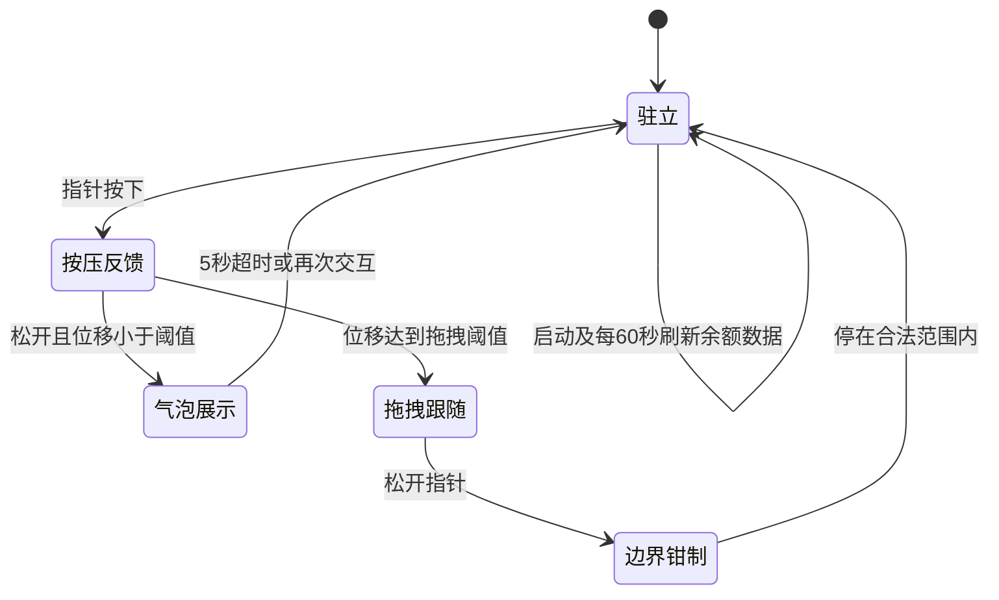

# 小橘3号（xiaoju3-agent）用户界面设计文档

| 项目 | 内容 |
| --- | --- |
| 项目名称 | 小橘3号（xiaoju3-agent）——住在家用设备里的私人 AI 管家 |
| 文档名称 | 用户界面设计文档 |
| 更新日期 | 2026-09-29 |
| 仓库 | <https://github.com/Xun201/xiaoju3-agent> |

**状态标记说明**（全文统一）：

- 🟢 已实现：能力已在仓库代码中核实（前端与后端均依据仓库源码逐一核对，均标注源码位置）；
- 🔜 规划中：出现在产品设计口径中、代码尚未见实现；
- 🔜 待确认：设计目标明确、实现细节待核实。

小橘3号的界面由"网页控制台 + 桌宠小挂件 + QQ 端 + 终端 CLI"构成，目标是把系统监控、对话交互、桌宠陪伴和权限管理收进一个干净、可自部署的界面体系。

---

## 1. 设计语言与风格定位

### 1.1 风格定位

- 产品口径：参考明日方舟 MAA 的干净、卡片式布局，代码完全自研。当前代码实现为浅色双栏简洁风，尚未出现卡片组件化特征，源码中也未引用 MAA 相关字样——**卡片式组件化 🔜 规划中**，演进路线见第 10 章。
- 技术形态：样式全部内联在页面中，无独立 CSS 文件、无构建链、无 UI 框架依赖，符合"完全自己写"的定位 🟢（`index.html:6-136`）。

### 1.2 界面载体现状

仓库当前并存三套网页界面，本文档以新版控制台为设计基准：

| 载体 | 说明 | 状态 |
| --- | --- | --- |
| 新版控制台 | `index.html` + `console.js` + `desktop-pet.js`，由 Flask 仪表盘经 `/console` 路由托管（端口 5003） | 🟢 |
| 旧版仪表盘内嵌页 | 蓝色主题单页，含运行时长与回复来源标签（`xiaoju3_dashboard.py:36-193`） | 🟢 兼容保留 |
| 内置简版聊天页 | 机器人主进程 `GET /` 提供的深色聊天页（`main.py:155-221`） | 🟢 兼容保留 |

### 1.3 设计令牌表（自 `index.html` 内联样式提取的实际值）

| 令牌 | 实际值 | 用途 |
| --- | --- | --- |
| 主色 | `#203170` 深蓝 | 面板标题、用户气泡底色、发送按钮、气泡描边 |
| 主色悬停 | `#2f4488` | 发送按钮悬停（`index.html:105`） |
| 页面底色 | `#f4f6f9` / `#f9fbfe` | body / 聊天区分层背景 |
| 卡片底色 | `#ffffff`，分隔线 `#e0e4ec` | 侧栏、聊天气泡、输入区 |
| 次级文字 | `#536ba9` / `#9fb0d9` | 标签、占位、气泡提示文字 |
| 进度底槽 | `#eef2fb` | CPU/内存进度条背景（高 8px、圆角 4px） |
| 成功色 | `#2fa24c` | 进度条正常态 |
| 警示色 | `#e0433f` | CPU/内存 > 80%、请求失败文字 |
| 点赞激活 | `#ef4444` / `#fef2f2` | 点赞按钮激活态（`index.html:134`） |
| 点踩激活 | `#3b82f6` / `#eff6ff` | 点踩按钮激活态（`index.html:135`） |
| 字体 | `'Segoe UI', Tahoma, Geneva, Verdana, sans-serif` | 全局系统无衬线栈 |
| 圆角 | 8px（输入框/按钮）、10px（消息气泡）、6px（工具按钮） | 控件层级 |
| 阴影 | 仅侧栏单向阴影 `2px 0 10px rgba(0,0,0,0.02)` | 弱卡片感 |
| 布局 | 左栏 33.33%（min-width 300px）/ 右聊天自适应 | 双栏骨架 |

### 1.4 主题演进

产品形象是橘色狐狸娘，"界面橘色"是设计目标；当前主题色为深蓝 `#203170`，橘色仅出现在吉祥物图片中。**全站橘色主题与皮肤系统 🔜 规划中**（见 10.1）。

---

## 2. 页面总体布局

### 2.1 双栏结构

左侧系统监控侧栏 + 右侧聊天窗口的固定双栏 🟢（`index.html:141-176`）；桌宠容器 `#xiaoju3-root` 预留在 `body` 末尾，以 JS 注入 DOM 的覆盖层方式叠加（`z-index: 99999`）。整页纯轮询通信（无 WebSocket），高度 100vh、不出现页面级滚动。

### 2.2 文本线框图（新版控制台 `:5003/console`）

```text
┌────────────────────────────────────────────────────────────────────┐
│  🦊 小橘3号 · 对话窗口                 [大脑来源：本地 ● / 云端 ○] 🔜  │
├──────────────────────────┬─────────────────────────────────────────┤
│  【系统状态】（33.33%）    │  【聊天窗口】                            │
│   CPU 占用        32%     │  ┌───────────────────────────────────┐  │
│   ▓▓▓░░░░░░░（进度条）     │  │ 小橘：你好！我是小橘3号，很高兴    │  │
│   内存占用        61%     │  │      为你服务喵~                  │  │
│   ▓▓▓▓░░░░░░（进度条）     │  │      [复制][刷新][👍][踩][播放][转发]│  │
│   系统温度       52.3 °C  │  │              用户：帮我看看CPU     │  │
│   ───────────────────    │  │  小橘：当前 CPU 32%，一切正常。    │  │
│   （余额/今日已用卡片 🔜）  │  └───────────────────────────────────┘  │
│                          │  ┌─────────────────────┬─────────────┐  │
│                          │  │ 输入消息，按回车发送… │    发送      │  │
│                          │  └─────────────────────┴─────────────┘  │
│        （桌宠活动范围：聊天区左缘 ↔ 输入区上沿之间的右下区域）   🦊     │
└──────────────────────────┴─────────────────────────────────────────┘
```

线框中标注 🔜 的"大脑来源徽标"与"余额卡片"为规划项：来源数据接口已就绪（`/api/chat` 返回 `reply,source`，`xiaoju3_dashboard.py:232-250`），余额接口亦已就绪（见第 3 章）。

### 2.3 界面入口一览（多端入口）

| 入口 | 形态 | 状态 |
| --- | --- | --- |
| 网页控制台 | 浏览器访问 `:5003/console`，本设计基准 | 🟢 |
| 内置简版页 | 机器人主进程 `:5002` 的 `GET /`（❌ 已随 5002 废弃下线，4f2d570） | — |
| 旧版页 | 仪表盘 `:5003` 的 `GET /` | 🟢 |
| QQ 端 | NapCat webhook 接入，群聊需 @ 或触发词"小橘/小桔/橘3号/橘三号/AI测试"（`main.py:123-128`） | 🟢 |
| 终端 CLI | `xiaoju3.py` 终端版对话入口 | 🟢 |
| 手机浏览器 | 移动端完整体验 | 🔜 规划中（见第 7 章） |

---

## 3. 系统监控面板

左侧栏以"进度条 + 数值"呈现系统状态（卡片式呈现为规划项）：

| 监控项 | 呈现 | 数据来源 | 状态 |
| --- | --- | --- | --- |
| CPU 占用 | 8px 进度条 + 百分比 | `GET /api/status`（psutil） | 🟢 |
| 内存占用 | 8px 进度条 + 百分比 | 同上 | 🟢 |
| 系统温度 | 大号数值 | 同上 | 🟢 |
| 余额 / 今日已用 | 侧栏卡片（规划） | `GET /api/balance` | 🔜（接口 🟢） |

**刷新机制** 🟢：

- 页面加载即请求一次，此后每 2 秒轮询 `GET /api/status`（`console.js:36-37`）；
- CPU 或内存超过 80% 时，进度条由绿 `#2fa24c` 变红 `#e0433f`（`console.js:16,24`）；
- 接口返回 `{code, data:{cpu, memory, temperature, timestamp}}`（`xiaoju3_dashboard.py:195-206`）。

**已知实现备注**：

- `console.js:29` 的温度 N/A 分支实际不会触发——后端异常时返回 `0.0` 而非字符串（`xiaoju3_dashboard.py:31-34`），异常呈现策略待统一；
- 旧版内嵌页读取 `data.temp / data.uptime` 字段与新接口返回的嵌套字段不匹配（`xiaoju3_dashboard.py:141-152` 对比 `195-206`），旧版监控显示失效，收敛界面时一并处理；
- 余额接口返回 `{balance, currency, today_usage, is_peak}`（`xiaoju3_dashboard.py:208-229`），但 `today_usage` 当前硬编码为 `0.0`（`xiaoju3_dashboard.py:225`），"今日已用"恒显示 ¥0.00，待接入真实消耗统计 🔜。

---

## 4. 聊天窗口

### 4.1 消息气泡与输入区

- 气泡圆角 10px、最大宽度 70%：AI 消息白底左对齐，用户消息深蓝底白字右对齐 🟢（`index.html:67-76`）；
- 页面内置欢迎语"你好！我是小橘3号，很高兴为你服务喵~" 🟢（`index.html:164`）；
- 输入区为单行输入框 + 发送按钮，支持回车发送 🟢（`index.html:166-169`）；
- 发送后先插入"小橘3号正在思考... 🧠"占位气泡，回复返回后替换；请求失败时以红色 `#e0433f` 显示错误气泡 🟢（`console.js:55-112`）；
- 聊天记录仅存于 DOM，无历史加载接口，刷新即失 🔜——历史持久化与加载接口为规划项（后端记忆已按 QQ/网页分文件保存 🟢，`main.py:24-28`）。

### 4.2 消息工具栏

AI 消息附带工具栏，悬停由半透明变全显（代码有、产品介绍未提）🟢（`console.js:77-96,119-162`）：

| 按钮 | 行为 | 状态 |
| --- | --- | --- |
| 复制 | 写入剪贴板，提示"已复制" | 🟢 |
| 播放 | `speechSynthesis` 朗读回复，播放前清空朗读队列 | 🟢 |
| 点赞 / 点踩 | 互斥（点一个自动取消另一个）、可取消，仅本地高亮不上报后端 | 🟢（反馈数据上报 🔜） |
| 刷新 / 转发 | `alert` 占位"开发中" | 🔜 规划中 |

### 4.3 模型与上下文状态显示

- **本地优先决策**：每条消息先探测本地 Ollama，在线即走本地模型，异常才自动切云端 DeepSeek（`brain.py:86-101`）；本地工具轮汇总固定走云端（`brain.py:133-137`）。界面计划以"本地/云端"徽标呈现大脑来源 🔜——后端已返回来源标签，旧版页在回复后附 `source` 标签 🟢（`xiaoju3_dashboard.py:36-193`），新版控制台尚未消费该字段；
- **上下文**：记忆保存时截断最近 50 条（`brain.py:28`）；"前情提要"压缩器已写好但未接入（`plugins/context_manager.py:1-41`）——上下文压缩及其界面呈现（如"前情提要"提示）🔜 规划中。

### 4.4 安全备注

回复经 `innerHTML` 模板注入、`res.data.reply` 未转义（`console.js:74-76`），存在 XSS 风险；规划改为文本转义后渲染。用户消息当前使用 `textContent` 注入，无此风险 🟢。

---

## 5. 桌宠小挂件

### 5.1 形象与实现方式

Q 版橘色狐狸娘，AI 生成 + 后期编辑，著作权归作者、他人不可商用。实现为 IIFE 单例注入（防重复注入 🟢，`desktop-pet.js:1-3`），基准尺寸 250px 并以 `--pet-scale` 变量整体缩放 🟢（`desktop-pet.js:12-15`）；形象图路径 `/assets/DSniang1.png`（`desktop-pet.js:110`），仓库当前无 `assets/` 目录，图片将 404——素材补齐与目录规范 🔜 待确认。

### 5.2 交互行为

| 行为 | 实现细节 | 状态 |
| --- | --- | --- |
| 短按弹出气泡 | 松开且未发生拖拽位移时弹出，5 秒自动关闭（`desktop-pet.js:170-173,223`） | 🟢 |
| 按压形变 | 按下 `scaleY(0.88) scaleX(1.05)`，松开复原（`:167-168`） | 🟢 |
| 拖拽 | Pointer Events + `setPointerCapture`，位移平方 > 9 判定进入拖拽（`:175-190`） | 🟢 |
| 边界钳制 | 左至聊天区左缘、下至输入区上沿、右与上至屏幕边缘（`:197-212`） | 🟢 |
| 窗口缩放跟随 | `resize` 时重新钳制位置（`:227-232`） | 🟢 |
| 吸附屏幕边缘 | 松手后距屏幕左/右边缘 < 24px 磁吸贴边（SNAP_THRESHOLD / snapToEdge） | 🟢（2026-10-02 回归上线） |
| 左右翻转 | 面向由桌宠中心 x 相对屏幕中线决定，`scaleX(-1)` 镜像（独立翻转层 .xiaoju-flip，与按压形变分离） | 🟢（2026-10-02 回归上线） |
| 移动端尺寸换算 | 视口 <600px 时按比例缩小（复用 `--pet-scale`） | 🟢（2026-10-02 回归上线） |

### 5.3 气泡内容类型

气泡为内联 SVG 对话框（白底、`#203170` 描边，含两个小椭圆气泡点，`desktop-pet.js:117-128`），文字区颜色 `#536ba9`、提示 `#9fb0d9` 🟢：

| 内容类型 | 数据来源 | 状态 |
| --- | --- | --- |
| DeepSeek 余额 | `GET /api/balance`，启动时 + 每 60 秒刷新（`:267-269`） | 🟢 |
| 今日已用 | 同上（金额文案已渲染，数值恒 ¥0.00） | 🟢 显示 / 🔜 数据真实化 |
| 随机台词 | 内置台词库 PET_LINES（8-12 条中文台词），与余额/今日已用轮换展示 | 🟢（2026-10-02 回归上线） |
| 图片气泡 | 无 | 🔜 规划中 |
| 内容自定义配置 | 无配置界面 | 🔜 规划中 |
| 拟人化情绪动画 | 结合情感计算与状态机，让桌宠展现更多拟人化情绪动画 | 🔜 规划中 |

### 5.4 桌宠状态机（已实现行为）



规划中的"图片气泡"与"内容自定义配置"仍见 10.4 路线图；边缘吸附与左右翻转已于 2026-10-02 随桌宠回归落地。

### 5.5 已知实现备注

- 气泡报错文案"请检查后端 5005 端口"**已修正**（历史批次已改，`desktop-pet.js` 全文已无 5005，现口径 5003）；
- 桌宠活动范围被限制在聊天区与输入区之间，即界面右下区域，不会遮挡监控侧栏 🟢。

---

## 6. 音效与动画

### 6.1 已实现动效（纯 CSS）🟢

| 动效 | 参数 | 位置 |
| --- | --- | --- |
| 桌宠按压形变 | `scaleY(0.88) scaleX(1.05)`，0.22s 回弹曲线 `cubic-bezier(.34,1.56,.64,1)` | `desktop-pet.js:28,167` |
| 气泡出现/消失 | `opacity + scale(0.7→1)`，0.2s；文字延迟 0.36s 淡入 | `desktop-pet.js:66-97` |
| 进度条变化 | `width` 0.3s 过渡 | `index.html:40` |
| 拖拽跟随 | 位置变化 0.16s `ease` | `desktop-pet.js:19` |

### 6.2 音效体系（产品口径，代码未见）🔜

- 按压音效、任务结束提示音、每轮对话消耗金额弹窗：全仓库无音频资源文件、无 `new Audio / AudioContext` 调用（grep 证实），均 🔜 规划中；
- 消耗弹窗依赖后端提供每轮 token/金额统计（当前 `today_usage` 硬编码 0.0），数据侧同步规划；
- 素材可替换：规划统一素材目录与命名约定（按压、提示、弹窗各一套，具体方案 🔜 待确认）；
- 版权合规：音效与动图采用 CC0 协议素材 🔜（当前仓库无任何音效/动图资源）。

---

## 7. 移动端适配

**现状** 🟢：`index.html` 无 viewport meta；三个前端文件 `@media` 查询数量均为 0（grep 证实）；侧栏 `min-width: 300px` 在手机上会挤压布局。桌宠拖拽基于 Pointer Events，天然支持触控 🟢（`desktop-pet.js:175-183`），手机上已可拖动桌宠。

**规划** 🔜：

- 增加 viewport meta 与响应式断点：窄屏时双栏折叠为单栏（监控区收起为可展开抽屉）；
- 桌宠移动端缩放换算（复用 `--pet-scale`）；
- 手机浏览器完整体验：看监控、聊天、拖拽桌宠，与桌面一致。

定位是**多端界面适配**：同一控制台自适应桌面与移动浏览器，QQ 端与终端 CLI 作为补充入口 🟢（"多终端可部署"在项目口径中指智能体可部署到任意算力达标终端的部署定位，见架构设计文档 §1、§8）。

---

## 8. 认证与提权交互（2026-10-02 权限重构定稿）

### 8.1 权限分级与界面呈现

四级矩阵（permission.py ACTION_LEVELS）：LV1 路人（聊天/搜索/读文件）→
LV2 普通用户（写文件/列目录，/register 密码注册）→ LV3 代码编写者（改代码/
管理插件/安全家居六类 domain，/coder_auth TOTP）→ LV4 主人级（危险设备
lock/valve/阀+DANGER_ENTITIES 自定义、ADB 全套、发图、restart_service、
装卸组件、核心记忆，/lv4_auth confirm TOTP 授权级验证）。

**操作级双因子与 /confirm 二次确认已删除**（2026-10-02）：授权后危险操作
不再逐次验证。儿童锁（批次②）：CHILD_LOCK_ENABLED=true 时，被登记为儿童
的用户（identity.json is_adults）执行危险家电操作需"在线成人 LV4"（最近
5 分钟内交互的 Lv.4）确认——QQ 私聊推送 🔒 请求，成人回复 /approve（以
主人级权限代为执行）或 /deny；无在线成人直接拒绝。

### 8.2 已实现的认证交互 🟢

| 交互 | 流程 | 位置 |
| --- | --- | --- |
| 网页鉴权 | /api/chat 三接口当前无鉴权（X-API-Key 为规划项） | xiaoju3_dashboard.py |
| QQ 注册/升级 | /register（Lv.2 密码注册）/ /coder_auth（Lv.3 TOTP） | main.py + permission.py |
| LV4 授权/撤销 | /lv4_auth confirm（授权级 TOTP）/ /lv4_revoke | main.py + auth_lv4.py |
| 儿童锁裁决 | /approve //deny（在线成人 LV4；网页控制台视为成人设备） | main.py + xiaoju3_dashboard.py |
| 创作者署名 | xiaoju3_data/creator.json 存在即激活：启动日志/控制台标题（/api/status creator 字段）//creator 命令/README | main.py + xiaoju3_dashboard.py + console.js |
| 注册名保护 | 称呼含英文字母 xun（大小写不敏感）即拒绝（创作者署名保护） | permission.py validate_claim_name |

安全备注：LV4 危险操作的物理机械开关优先级不变（功能文档 §8.0）；
生物认证列入 V1.1 规划。

## 9. 交互规范汇总

### 9.1 事件 → 响应表

| 事件 | 响应 | 状态 |
| --- | --- | --- |
| 每 2 秒定时 | 轮询 `/api/status` 刷新监控 | 🟢 |
| CPU/内存 > 80% | 进度条变红 `#e0433f` | 🟢 |
| 每 60 秒定时 | 轮询 `/api/balance` 刷新余额 | 🟢 |
| 指针按下桌宠 | 按压形变（音效 🔜） | 🟢 |
| 按住移动 ≥ 阈值 | 进入拖拽跟随 | 🟢 |
| 松开且未移动 | 弹出余额气泡 | 🟢 |
| 气泡 5 秒超时 | 自动关闭 | 🟢 |
| 松开指针（拖拽后） | 边界钳制定位 | 🟢 |
| 窗口 resize | 桌宠位置重新钳制 | 🟢 |
| 发送消息 | "正在思考🧠"占位 → 回复替换；失败显红色错误气泡 | 🟢 |
| 回车键 | 等同点击发送 | 🟢 |
| 复制 / 播放按钮 | 剪贴板写入 / TTS 朗读 | 🟢 |
| 点赞 / 点踩 | 本地互斥高亮，可取消 | 🟢 |
| 任务结束 | 提示音 | 🔜 |
| 每轮对话完成 | 消耗金额弹窗 | 🔜 |
| `/coder_auth` | 升级 LV3 | 🟢 |
| 终止 / 重启脚本 | 密码 / 动态码确认 | 🟢 |

### 9.2 动效参数表

| 参数 | 值 |
| --- | --- |
| 状态轮询周期 | 2s（状态）/ 60s（余额） |
| 气泡自动关闭 | 5s |
| 拖拽位移阈值 | 位移平方 > 9（px²） |
| 桌宠基准尺寸 | 250px × `--pet-scale` |
| 按压形变 | 0.22s 回弹曲线 |
| 气泡过渡 | 0.2s（文字延迟 0.36s 淡入） |
| 进度条过渡 | 0.3s |
| 拖拽位置过渡 | 0.16s ease |
| 侧栏宽度 | 33.33%（min-width 300px） |
| 音效时长 | 待定 🔜 |

---

## 10. 规划与路线图

### 10.1 皮肤系统 🔜

全站橘色主题（与狐狸娘形象同源色）、多主题切换，形象/音效/动图素材统一目录并可替换；音效动图坚持 CC0 素材合规，吉祥物形象著作权归作者、不可商用。

### 10.2 气泡自定义增强 🔜

在余额/今日已用之外，增加随机台词库、图片气泡，以及气泡内容源的自定义配置界面（用户自选展示余额、台词或图片）。

### 10.3 配置面板增强 🔜

当前配置依赖本地配置文件与 shell 脚本，无网页配置界面；规划图形化配置：告警阈值（80%）、轮询周期（2s/60s）、气泡内容、密钥注入方式等——密钥类配置只写配置项、仅存本地设备，不上传仓库。

### 10.4 规划路线图（汇总全文 🔜 项）

| 阶段 | 能力 | 出处 |
| --- | --- | --- |
| 近期 | 聊天历史加载接口与持久化；回复转义防 XSS；新版控制台补"大脑来源"徽标；`today_usage` 真实统计接入 | 第 3、4 章 |
| 近期 | MAA 卡片式组件化改版 + 橘色主题（皮肤系统） | 第 1、10 章 |
| 中期 | 桌宠边缘吸附、左右翻转、移动端缩放；气泡随机台词/图片/自定义配置 | 第 5、10 章 |
| 中期 | 移动端响应式（viewport、断点、单栏折叠）；刷新/转发按钮实装 | 第 4、7 章 |
| 中期 | 音效体系（按压音效、任务提示音、消耗弹窗）与素材可替换 | 第 6 章 |
| 远期 | LV2 注册流程（`/register` 处理器 + 一键部署自动申请）；LV4 动态密码 + 生物认证等多因素与类 Root 警告 | 第 8 章 |
| 远期 | 网页配置面板；上下文"前情提要"压缩及其界面呈现 | 第 4、10 章 |
| 拟真交互前端 | 情绪气泡与状态展示；用户画像设置面板；语音唤醒悬浮窗；屏幕守望状态指示灯等拟真 AI 配套界面 | 第 5、10 章 |

---

本文档依据仓库源码核实编写（各能力均标注源码位置），不含任何密钥、密码或令牌等敏感信息；规划项以产品口径为准，随实现推进更新状态标记。
